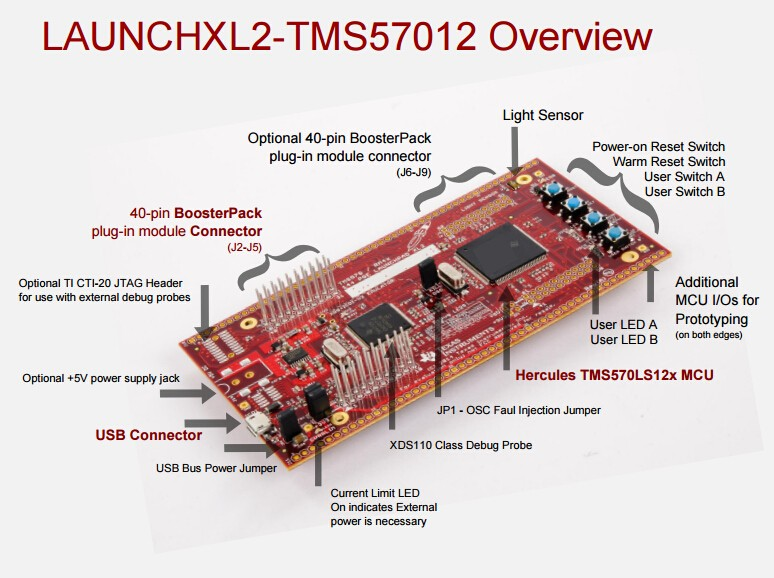
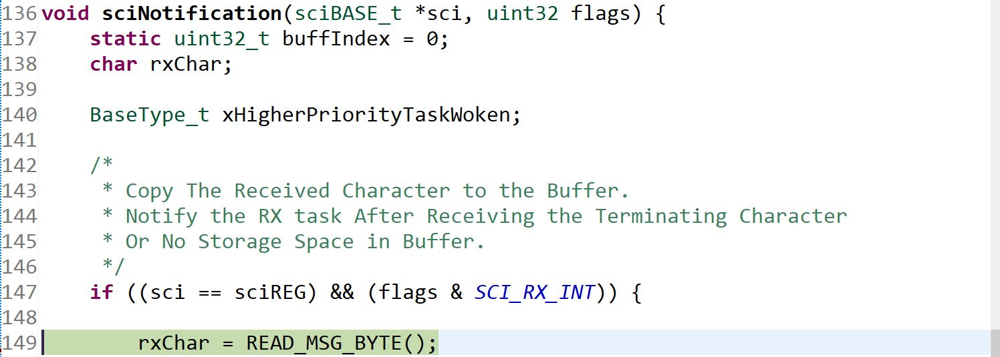
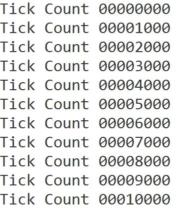

# TMS570LS1224 FreeRTOS SCI Loopback

## Contents

* [Overview](#Overview)
* [Code Composer Studio](#Code-Composer-Studio)
    * [Debugger](#Debugger)
* [SCI Loopback](#SCI-Loopback)
    * [SCI Data Buffers](#SCI-Data-Buffers)
* [FreeRTOS Architecture](#FreeRTOS-Architecture)
    * [Tasks](#Tasks)
    * [Mutual Exclusion](#Semaphore)
        * [Producer-Consumer Design](#Producer-Consumer-Design)
    * [Interrupt Service Routine](#ISR)
    * [Task Delay](#Task-Delay)
* [Credit](#Credit)

## Overview

A basic <b>SCI Loopback</b> program is written in <b>C</b> to transmit and receive a message with the same <b>SCI</b> peripheral.
on the <b>TMS5701224 Hercules Launchpad</b> for Safety Microcontrollers. This involved writing <b>FreeRTOS</b> tasks to perform the <b>SCI Transmission</b> and <b>Receive</b> functionalities.

The <b>SCI Driver</b> and <b>FreeRTOS Port</b> files were generated from skeleton code from the <b>UBC Orbit Satellite Design Team</b>. The source code is written using a <b>Hardware Abstraction Layer</b> in [(`sys_main.c`)](source/sys_main.c).

<p align="center"></p>

## Code Composer Studio

<b>Code Composer Studio (CCS)</b> is an <b>Eclipse</b> based <b>IDE</b> to develop applications for <b>Texas Instruments (TI)</b> embedded processors.

We will be using the <b>ARM</b> compiler included with <b>CCS</b> to create our executable.

### Debugger

<b>CCS</b> allows us to use the <b>XDS 110</b> entry level debug probe to step through the code after flashing the executable file to the microcontroller. This allows us to view the contents of the registers during runtime and determine if our <b>SCI Loopback</b> is working as designed.

We set a breakpoint in the <b>Interrupt Service Routine (i.e. ISR)</b> for <b>SCI RX</b> interrupt events. We break code execution upon reading a byte from the <b>Receive Data Buffer (i.e. SCIRD)</b>, as shown below.

<p align="center"></p>

## SCI Loopback

The purpose of the <b>SCI Loopback</b> is to transmit and receive the same data with the same peripheral. This allows us to test other functionality during data transfers. We are particularly interested in testing mutual exclusion with semaphores.

### SCI Data Buffers

Viewing the contents of the <b>Receive Data Buffer (i.e. SCIRD)</b> when the program hits the breakpoint above shows us that the byte from the <b>Transmit Data Buffer (i.e. SCITD)</b> is received as intended.

Here is a sample of the <b>CCS</b> register displays during runtime.

<b>.</b> | Register Contents
:-------------------------: | :-------------------------:
1  | 
2  | 
3  | 


The <b>TMS570LS1224 Technical Reference Manual</b> specifies that the <b>SCI Data Buffers</b> contain 8 bits of data. Due to this, we must copy a byte of data (i.e. a character) from the <b>SCIRD</b> register to the variable ```static uint8_t rxBuff[LENGTH_BUFF];``` at a time.

## FreeRTOS Architecture

We will be using the <b>FreeRTOS Kernel</b> to periodically schedule and run the <b>SCI TX</b> and <b>SCI RX</b> tasks. We must use <b>Static APIs</b> to refrain from dynamic allocation in our microcontroller.

### Tasks

<b>Task Creation</b> for the <b>SCI TX</b> and <b>RX</b> functionality is nearly identical. These must be created before starting the scheduler included with <b>FreeRTOS</b>, as shown below.

```c
    /* Create SCI TX Task. */
    xTaskCreateStatic(
        sciTxTask, //
        "SCI TX Task", // Task Name
        DEFAULT_STACK_SIZE, // Stack Size for Task
        NULL, // Parameter Pointers
        DEFAULT_TASK_PRIORITY, // Task Priority
        txStackBuffer, // Stack
        &txTaskBuffer // Task Control Block
    );

    /* Create SCI RX Task. */
    xTaskCreateStatic(
        sciRxTask, //
        "SCI RX Task", // Task Name
        DEFAULT_STACK_SIZE, // Stack Size for Task
        NULL, // Parameter Pointers
        DEFAULT_TASK_PRIORITY, // Task Priority
        rxStackBuffer, // Stack
        &rxTaskBuffer // Task Control Block
    );
```

Note : The stack buffer is defined as an array of type `uint32_t` and size `DEFAULT_STACK_SIZE`. The task buffer for the <b>Task Control Block (i.e. TCB)</b> is defined as type `StaticTask_t`.

## Semaphore

We use semaphores as a signalling mechanism that the buffer  ```static uint8_t rxBuff[LENGTH_BUFF];``` contains a complete message. This allows us to determine when the <b>SCI RX</b> task should run.

We create the semaphore before creating the tasks or starting the scheduler, by calling
```sciRxSem = xSemaphoreCreateBinaryStatic(&sciRxSemBuffer);```.

We pass a pointer to a semaphore buffer of type ```StaticSemaphore_t``` as a parameter and assign the return value to a semaphore handle variable.

We give the semaphore every time a complete message is received and processed from the <b>SCI</b> peripheral. This is done in the <b>ISR</b>.

We try to periodically take the semaphore by calling ```xSemaphoreTake(sciRxSem, waitTime);```. In the meantime, the <b>SCI RX</b> task is in a <b>Blocked</b> state and other threads in the <b>Ready</b> state are run.

### Producer-Consumer Design

The relationship described between the tasks is analogous to a producer-consumer design. In our case, the <b>SCI TX</b> task and <b>ISR</b> for <b>SCI RX</b> interrupt events act as producers. They add data to the shared message buffer.

This data is used by the <b>SCI RX</b> task, which acts as a consumer task.

## ISR

The <b>SCI RX</b> events are handled by our callback function for <b>SCI</b> interrupts. We must use the interrupt-safe version of the <b>FreeRTOS API</b> by calling ```xSemaphoreGiveFromISR(sciRxSem, &xTaskWoken);```. These <b>API</b> functions never block code execution.

We pass a pointer to a ```BaseType_t``` variable to see if a task is woken by increasing the semaphore count. If a task is woken, it is called immediately upon completion of the <b>ISR</b>.

This variable is once again passed at the end of the callback function as we yield operation to the scheduler by calling ```portYIELD_FROM_ISR(xTaskWoken);```.

## Task Delay

To periodically generate a message and send it to the <b>SCI</b> peripheral, we call the <b>FreeRTOS API</b> ```vTaskDelayUntil(...);``` to keep the <b>SCI TX</b> task in a <b>Blocked</b> state for the duration of ```MSG_DEADLINE```.

```c
/* Next Message is Sent After MSG_DEADLINE Delay. */
vTaskDelayUntil(
    &xLastWakeTime, // Time At Which Task Was Last Unblocked
    MSG_DEADLINE // Cycle Time Period
);
```

If the message isn't generated and transmitted by ``MSG_DEADLINE``, the semaphore is not available to be taken by the <b>SCI RX</b> task. This is highly problematic as ```ABORT("RX Task Missed a Deadline!\r\n");``` is called and code execution is effectively placed in an infinite loop.

If the <b>SCI TX</b> task runs in the correct period, it generates an output to the serial terminal as shown below.

<p align="center"></p>

## Credit

This <b>SCI Loopback</b> program was written as a lab for a Firmware Bootcamp for the <b>UBC Orbit Satellite Design Team</b>.